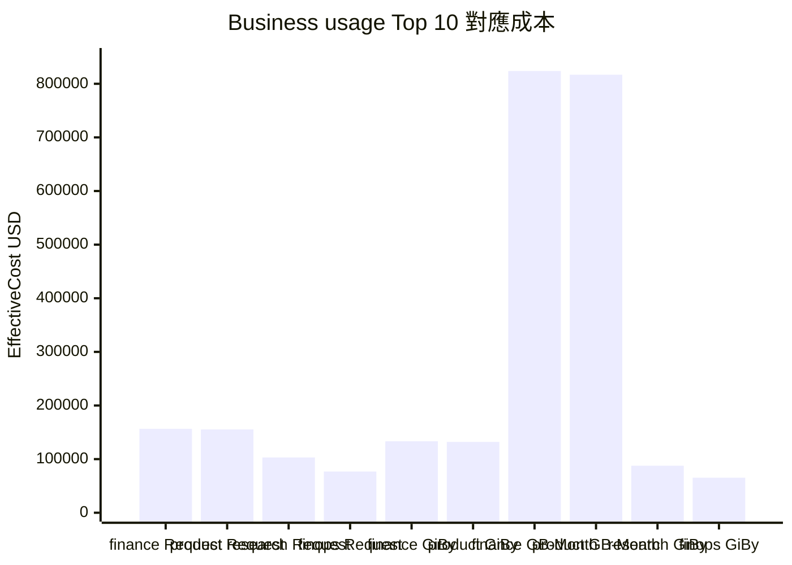
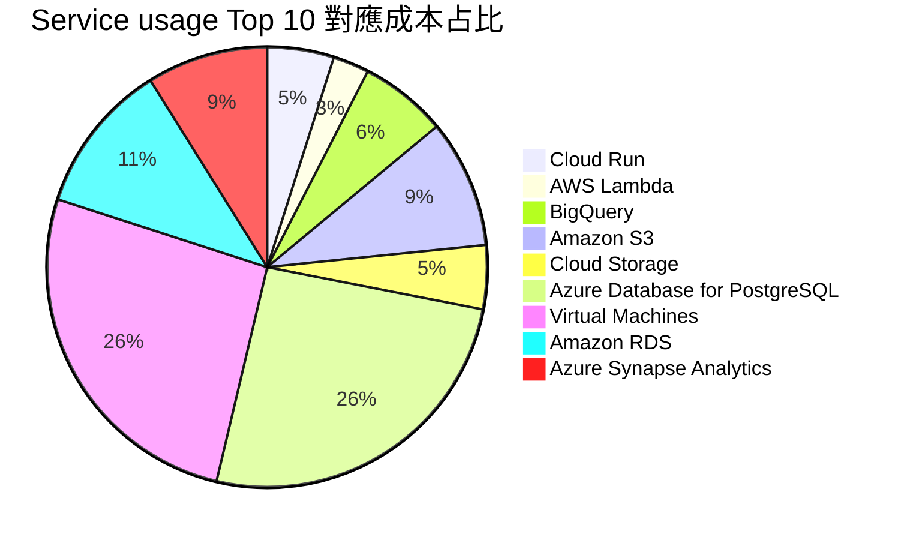
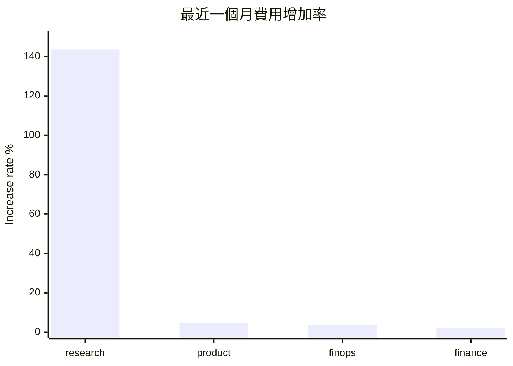

# demo001：用量與費用成長 Top 10

本 demo 示範三個常見 FinOps 分析問題：

1. 查詢用量 Top 10 的業務。
2. 查詢用量 Top 10 的 service。
3. 查詢最近一個月費用增加比率最多的 Top 10 業務。

## 查詢檔案

### 01_business_usage_top10.sql

依業務與 `ConsumedUnit` 彙總用量，保留不同用量單位，避免把 Hour、GB-Month、Request 等不同度量直接相加。

```sql
WITH usage_by_business AS (
    SELECT
        COALESCE(
            p.business_unit,
            cu."Tags" ->> 'cost_center',
            cu."Tags" ->> 'owner',
            cu."SubAccountName",
            'Unmapped'
        ) AS business_name,
        cu."ConsumedUnit",
        cu."ConsumedQuantity" * COALESCE(pca.allocation_weight, 1.000000) AS allocated_consumed_quantity,
        cu."EffectiveCost" * COALESCE(pca.allocation_weight, 1.000000) AS allocated_effective_cost
    FROM focus.cost_usage cu
    LEFT JOIN business.cloud_accounts ca
        ON ca.service_provider_name = cu."ServiceProviderName"
        AND ca.billing_account_id = cu."BillingAccountId"
        AND ca.sub_account_id = cu."SubAccountId"
    LEFT JOIN business.project_cloud_accounts pca
        ON pca.cloud_account_key = ca.cloud_account_key
    LEFT JOIN business.company_projects p
        ON p.project_id = pca.project_id
    WHERE cu."ConsumedQuantity" IS NOT NULL
)
SELECT
    business_name,
    "ConsumedUnit",
    round(sum(allocated_consumed_quantity), 6) AS consumed_quantity,
    round(sum(allocated_effective_cost), 2) AS effective_cost
FROM usage_by_business
GROUP BY 1, 2
ORDER BY consumed_quantity DESC
LIMIT 10;
```

範例結果：

| business_name | ConsumedUnit | consumed_quantity | effective_cost |
|---|---|---:|---:|
| finance | Request | 18654363119.724429 | 156608.34 |
| product | Request | 18496346371.756691 | 155281.75 |
| research | Request | 12285054856.221666 | 103136.31 |
| finops | Request | 9151465407.345397 | 76828.99 |
| finance | GiBy | 29597264.183026 | 133187.69 |
| product | GiBy | 29346552.678216 | 132059.49 |
| finance | GB-Month | 19767737.801341 | 823842.28 |
| product | GB-Month | 19600289.915788 | 816863.70 |
| research | GiBy | 19491633.767659 | 87712.35 |
| finops | GiBy | 14519838.473685 | 65339.27 |

圖表呈現：

`ConsumedUnit` 混合 Request、GiBy、GB-Month，不適合把用量放在同一張比例圖比較；以下改用同一貨幣口徑的 `effective_cost` 顯示 Top 10 用量列對應成本。



### 02_service_usage_top10.sql

依 provider、service、`ConsumedUnit` 彙總用量與成本。

```sql
SELECT
    "ServiceProviderName",
    "ServiceCategory",
    "ServiceName",
    "ConsumedUnit",
    round(sum("ConsumedQuantity"), 6) AS consumed_quantity,
    round(sum("EffectiveCost"), 2) AS effective_cost
FROM focus.cost_usage
WHERE "ConsumedQuantity" IS NOT NULL
GROUP BY 1, 2, 3, 4
ORDER BY consumed_quantity DESC
LIMIT 10;
```

範例結果：

| ServiceProviderName | ServiceCategory | ServiceName | ConsumedUnit | consumed_quantity | effective_cost |
|---|---|---|---|---:|---:|
| Google Cloud | Compute | Cloud Run | Request | 39366310959.044731 | 318867.12 |
| AWS | Compute | AWS Lambda | Request | 19220918796.003452 | 172988.27 |
| Google Cloud | Analytics | BigQuery | GiBy | 92955289.102586 | 418298.80 |
| AWS | Storage | Amazon S3 | GB-Month | 28973604.865139 | 612791.74 |
| Google Cloud | Storage | Cloud Storage | GB-Month | 16985928.238216 | 305746.71 |
| Microsoft | Database | Azure Database for PostgreSQL | GB-Month | 16124440.969313 | 1668879.64 |
| Microsoft | Compute | Virtual Machines | Hour | 3657257.276559 | 1711596.40 |
| AWS | Database | Amazon RDS | Hour | 2438171.518836 | 724136.94 |
| Microsoft | Analytics | Azure Synapse Analytics | Hour | 536397.733672 | 579309.55 |

圖表呈現：

這個結果同樣有不同 `ConsumedUnit`，所以圓餅圖採用 `effective_cost` 呈現 Top service 的成本占比。



### 03_business_cost_growth_top10.sql

以資料中最新月份與前一月份比較，列出費用增加比率最高的業務。

```sql
WITH business_cost_rows AS (
    SELECT
        COALESCE(
            p.business_unit,
            cu."Tags" ->> 'cost_center',
            cu."Tags" ->> 'owner',
            cu."SubAccountName",
            'Unmapped'
        ) AS business_name,
        cu."BillingCurrency",
        date_trunc('month', cu."ChargePeriodStart")::date AS charge_month,
        cu."EffectiveCost" * COALESCE(pca.allocation_weight, 1.000000) AS allocated_effective_cost
    FROM focus.cost_usage cu
    LEFT JOIN business.cloud_accounts ca
        ON ca.service_provider_name = cu."ServiceProviderName"
        AND ca.billing_account_id = cu."BillingAccountId"
        AND ca.sub_account_id = cu."SubAccountId"
    LEFT JOIN business.project_cloud_accounts pca
        ON pca.cloud_account_key = ca.cloud_account_key
    LEFT JOIN business.company_projects p
        ON p.project_id = pca.project_id
),
monthly_business_costs AS (
    SELECT
        business_name,
        "BillingCurrency",
        charge_month,
        sum(allocated_effective_cost) AS effective_cost
    FROM business_cost_rows
    GROUP BY 1, 2, 3
),
latest_month AS (
    SELECT max(charge_month) AS current_month
    FROM monthly_business_costs
),
period_costs AS (
    SELECT
        mbc.business_name,
        mbc."BillingCurrency",
        lm.current_month,
        lm.current_month - interval '1 month' AS previous_month,
        sum(mbc.effective_cost) FILTER (
            WHERE mbc.charge_month = lm.current_month
        ) AS current_month_cost,
        sum(mbc.effective_cost) FILTER (
            WHERE mbc.charge_month = (lm.current_month - interval '1 month')::date
        ) AS previous_month_cost
    FROM monthly_business_costs mbc
    CROSS JOIN latest_month lm
    WHERE mbc.charge_month IN (
        lm.current_month,
        (lm.current_month - interval '1 month')::date
    )
    GROUP BY 1, 2, 3, 4
)
SELECT
    business_name,
    "BillingCurrency",
    current_month,
    previous_month::date AS previous_month,
    round(current_month_cost, 2) AS current_month_cost,
    round(previous_month_cost, 2) AS previous_month_cost,
    round(current_month_cost - previous_month_cost, 2) AS cost_increase,
    round(
        ((current_month_cost - previous_month_cost) / NULLIF(previous_month_cost, 0)) * 100,
        2
    ) AS increase_rate_percent
FROM period_costs
WHERE current_month_cost > previous_month_cost
    AND previous_month_cost > 0
ORDER BY increase_rate_percent DESC, cost_increase DESC
LIMIT 10;
```

範例結果：

| business_name | BillingCurrency | current_month | previous_month | current_month_cost | previous_month_cost | cost_increase | increase_rate_percent |
|---|---|---|---|---:|---:|---:|---:|
| research | USD | 2026-12-01 | 2026-11-01 | 40705.69 | 16712.01 | 23993.68 | 143.57 |
| product | USD | 2026-12-01 | 2026-11-01 | 42788.52 | 40918.95 | 1869.57 | 4.57 |
| finops | USD | 2026-12-01 | 2026-11-01 | 18690.03 | 18058.51 | 631.52 | 3.50 |
| finance | USD | 2026-12-01 | 2026-11-01 | 37769.82 | 36982.42 | 787.40 | 2.13 |

圖表呈現：


