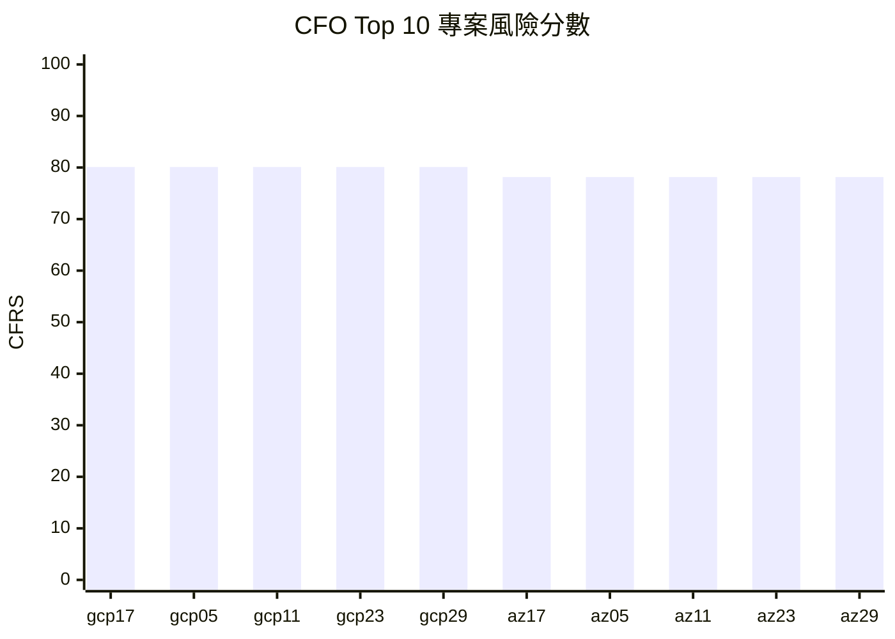
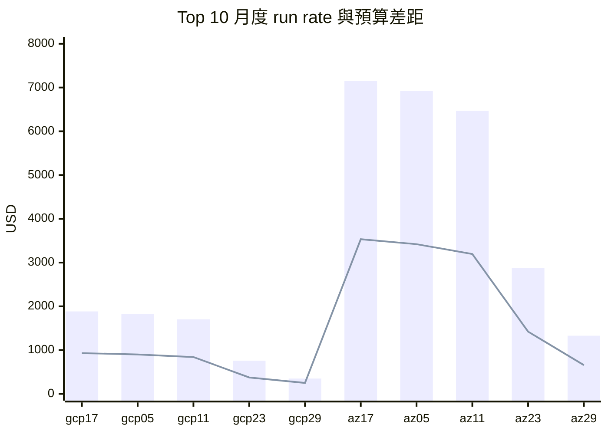
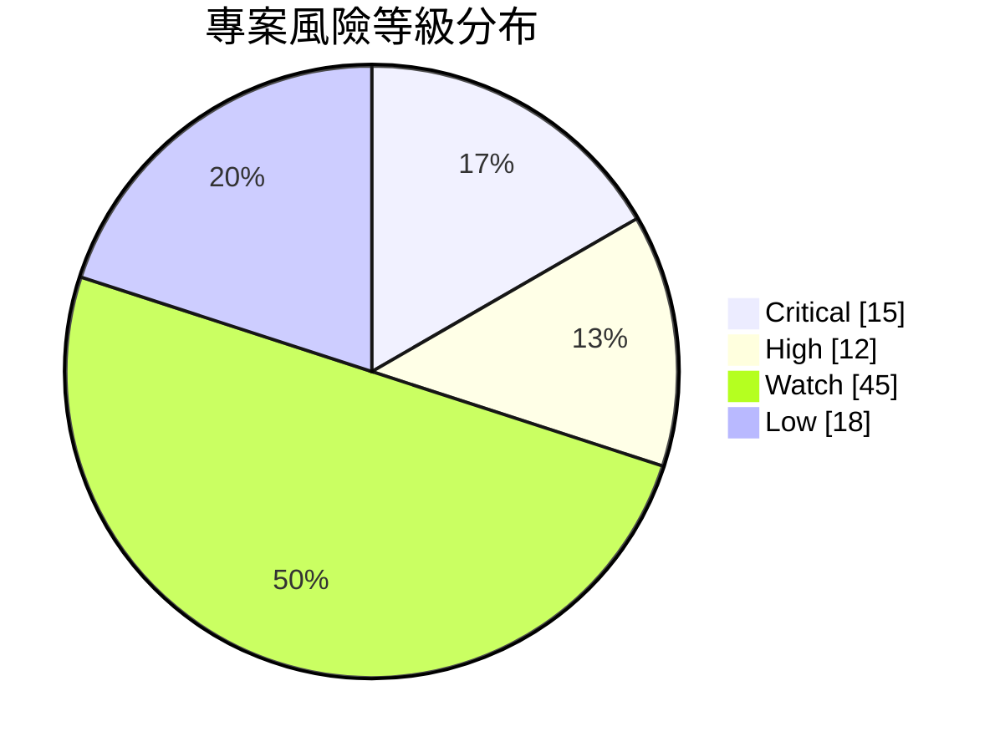
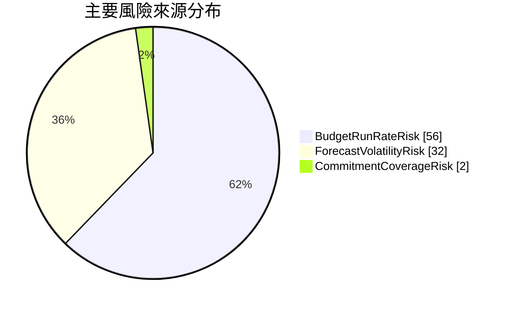

# demo004：CFO 財務風險量化指標

本 demo 將 `docs/cfo_financial_risk_metric.md` 的 Cloud Financial Risk Score, CFRS, 實作成可查詢的 PostgreSQL 範例。

CFO 觀點不是只看哪個專案花最多錢，而是判斷哪些專案正在讓預算、預測可信度、折扣效率或成本集中度變得不可控。

## CFO 敘事

這個 demo 讓財務團隊可以把雲端支出轉成一張風險排序表：先找出高風險專案，再看風險是來自預算燃燒、成本加速、預測波動、折扣不足，還是服務集中。這讓 FinOps 從月底解釋成本，往前推進成月中就能治理財務風險。

## 實際執行結果

以下結果來自本機 PostgreSQL 驗證輸出，原始 logs 保存在 ignored 的 `outputs/demo004/` 目錄中。

### 驗證摘要

| 驗證項目 | 結果 |
|---|---:|
| `focus.cost_usage` 欄位數 | 107 |
| `focus.cost_usage` 資料列 | 493,020 |
| `business.project_budgets` 資料列 | 90 |
| `business.mv_project_financial_risk_score` 資料列 | 90 |

### CFO Top 10 高風險專案

| project_id | project_name | business_unit | score_as_of_date | monthly_budget | month_to_date_effective_cost | current_month_run_rate | cloud_financial_risk_score | risk_level | primary_risk_driver |
|---|---|---|---|---:|---:|---:|---:|---|---|
| `gcp-prj-17` | GCP Project 17 | research | 2026-12-31 | 930.63 | 1,883.76 | 1,883.76 | 80.10 | Critical | BudgetRunRateRisk |
| `gcp-prj-05` | GCP Project 05 | research | 2026-12-31 | 900.88 | 1,823.53 | 1,823.53 | 80.10 | Critical | BudgetRunRateRisk |
| `gcp-prj-11` | GCP Project 11 | research | 2026-12-31 | 841.37 | 1,703.08 | 1,703.08 | 80.10 | Critical | BudgetRunRateRisk |
| `gcp-prj-23` | GCP Project 23 | research | 2026-12-31 | 374.58 | 758.22 | 758.22 | 80.10 | Critical | BudgetRunRateRisk |
| `gcp-prj-29` | GCP Project 29 | research | 2026-12-31 | 250.00 | 349.92 | 349.92 | 80.10 | Critical | BudgetRunRateRisk |
| `az-prj-17` | Azure Project 17 | research | 2026-12-31 | 3,533.48 | 7,152.35 | 7,152.35 | 78.15 | Critical | BudgetRunRateRisk |
| `az-prj-05` | Azure Project 05 | research | 2026-12-31 | 3,420.51 | 6,923.67 | 6,923.67 | 78.15 | Critical | BudgetRunRateRisk |
| `az-prj-11` | Azure Project 11 | research | 2026-12-31 | 3,194.56 | 6,466.33 | 6,466.33 | 78.15 | Critical | BudgetRunRateRisk |
| `az-prj-23` | Azure Project 23 | research | 2026-12-31 | 1,422.24 | 2,878.85 | 2,878.85 | 78.15 | Critical | BudgetRunRateRisk |
| `az-prj-29` | Azure Project 29 | research | 2026-12-31 | 656.36 | 1,328.58 | 1,328.58 | 78.15 | Critical | BudgetRunRateRisk |





### 風險來源彙總

| risk_level | primary_risk_driver | project_count | average_risk_score | month_to_date_effective_cost | current_month_run_rate | monthly_budget |
|---|---|---:|---:|---:|---:|---:|
| Critical | BudgetRunRateRisk | 15 | 78.68 | 40,705.70 | 40,705.70 | 20,186.98 |
| High | BudgetRunRateRisk | 12 | 54.49 | 14,664.03 | 14,664.03 | 12,171.74 |
| Watch | BudgetRunRateRisk | 15 | 38.32 | 27,615.41 | 27,615.41 | 20,934.76 |
| Watch | ForecastVolatilityRisk | 30 | 36.89 | 37,689.38 | 37,689.38 | 38,467.78 |
| Low | ForecastVolatilityRisk | 2 | 23.86 | 387.43 | 387.43 | 500.00 |
| Low | BudgetRunRateRisk | 14 | 10.46 | 18,539.23 | 18,539.23 | 20,112.29 |
| Low | CommitmentCoverageRisk | 2 | 7.08 | 352.91 | 352.91 | 500.00 |





### CFO 解讀

這次結果顯示 `BudgetRunRateRisk` 是 Critical 與 High 專案的主要風險來源，代表第一版 CFRS 很清楚地抓到「照目前速度會超出預算」的 CFO 問題。這適合作為財務風險升級 demo，但也提醒後續版本應加入更強的 volatility、concentration 與 commitment 情境，避免整體分數長期被 run rate 單一因素主導。

## 輸出欄位

| 欄位 | CFO 解讀 |
|---|---|
| `cloud_financial_risk_score` | 0 到 100 的專案財務風險總分 |
| `risk_level` | Low、Watch、High 或 Critical |
| `primary_risk_driver` | 對總分貢獻最大的風險來源 |
| `current_month_run_rate` | 依本月至今成本推估的整月成本 |
| `monthly_budget` | CFO 月度預算基準 |
| `recommended_cfo_action` | 依分數建議採取的治理動作 |

## 實作過程

以下保留可追溯的 demo 流程、風險公式與分段 SQL。CFO 先讀前面的結果與敘事；需要驗證或修改邏輯時，再從這裡往下檢查。

## Demo 流程

1. `01_create_project_budgets.sql` 建立 `business.project_budgets`，並依目前成本資料產生專案月度與年度預算基準。
2. `02_create_project_financial_risk_score.sql` 建立 `business.mv_project_financial_risk_score`，計算五個風險子指標與 CFRS 總分。
3. `03_cfo_financial_risk_score_top10.sql` 輸出 CFO 應優先追蹤的 Top 10 高風險專案。
4. `04_financial_risk_driver_breakdown.sql` 依風險等級與主要風險來源彙總，支援財務風險會議討論。

## 風險公式

```text
CFRS = 100 * (
    0.30 * BudgetRunRateRisk
  + 0.25 * CostAccelerationRisk
  + 0.20 * ForecastVolatilityRisk
  + 0.15 * CommitmentCoverageRisk
  + 0.10 * ConcentrationRisk
)
```

## 執行順序與 SQL 內容

建議先載入五年 daily seed，讓移動平均與波動風險更有意義。以下依執行順序列出 demo004 使用的 SQL 內容；為了降低閱讀負擔，較長的 SQL 會拆成多個片段呈現。實際執行時，仍以同一個 `.sql` 檔案的完整內容為一個執行單位。

### 01_create_project_budgets.sql

建立 CFO 專案預算表，並依目前成本資料產生月度與年度預算基準。

#### 01-A 清理舊物件並建立預算表

```sql
DROP MATERIALIZED VIEW IF EXISTS business.mv_project_financial_risk_score;
DROP TABLE IF EXISTS business.project_budgets;

CREATE TABLE business.project_budgets (
    project_id text NOT NULL,
    project_name text NOT NULL,
    business_unit text NOT NULL,
    billing_currency char(3) NOT NULL,
    budget_period_start date NOT NULL,
    monthly_budget numeric(20, 6) NOT NULL,
    annual_budget numeric(20, 6) NOT NULL,
    budget_owner text NOT NULL DEFAULT 'CFO Office',
    budget_status text NOT NULL DEFAULT 'Active',
    created_at timestamptz NOT NULL DEFAULT now(),
    PRIMARY KEY (project_id, billing_currency, budget_period_start),
    CHECK (monthly_budget > 0),
    CHECK (annual_budget >= monthly_budget)
);
```

#### 01-B 將 FOCUS 成本映射到 project 與每日成本

```sql
WITH project_cost_rows AS (
    SELECT
        COALESCE(
            p.project_id,
            cu."Tags" ->> 'project',
            lower(regexp_replace(COALESCE(cu."SubAccountId", cu."Tags" ->> 'app', 'unmapped'), '[^a-zA-Z0-9]+', '-', 'g'))
        ) AS project_id,
        COALESCE(
            p.project_name,
            cu."SubAccountName",
            cu."Tags" ->> 'app',
            'Unmapped project'
        ) AS project_name,
        COALESCE(
            p.business_unit,
            cu."Tags" ->> 'cost_center',
            cu."Tags" ->> 'owner',
            'Unmapped'
        ) AS business_unit,
        COALESCE(cu."Tags" ->> 'workload_pattern', 'mapped') AS workload_pattern,
        cu."BillingCurrency" AS billing_currency,
        date_trunc('day', cu."ChargePeriodStart")::date AS charge_day,
        cu."EffectiveCost" * COALESCE(pca.allocation_weight, 1.000000) AS allocated_effective_cost
    FROM focus.cost_usage cu
    LEFT JOIN business.cloud_accounts ca
        ON ca.service_provider_name = cu."ServiceProviderName"
        AND ca.billing_account_id = cu."BillingAccountId"
        AND ca.sub_account_id = cu."SubAccountId"
    LEFT JOIN business.project_cloud_accounts pca
        ON pca.cloud_account_key = ca.cloud_account_key
    LEFT JOIN business.company_projects p
        ON p.project_id = pca.project_id
),
daily_project_costs AS (
    SELECT
        project_id,
        project_name,
        business_unit,
        billing_currency,
        workload_pattern,
        charge_day,
        sum(allocated_effective_cost) AS daily_effective_cost
    FROM project_cost_rows
    GROUP BY 1, 2, 3, 4, 5, 6
),
latest_day AS (
    SELECT max(charge_day) AS max_charge_day
    FROM daily_project_costs
),
```

#### 01-C 取最近 90 天成本並套用 CFO 預算假設

```sql
recent_project_costs AS (
    SELECT
        d.project_id,
        max(d.project_name) AS project_name,
        max(d.business_unit) AS business_unit,
        d.billing_currency,
        max(d.workload_pattern) AS workload_pattern,
        avg(d.daily_effective_cost) AS average_recent_daily_cost,
        count(*) AS observed_days
    FROM daily_project_costs d
    CROSS JOIN latest_day ld
    WHERE d.charge_day > ld.max_charge_day - interval '90 days'
    GROUP BY 1, 4
),
budget_assumptions AS (
    SELECT
        project_id,
        project_name,
        business_unit,
        billing_currency,
        CASE
            WHEN workload_pattern = 'growth-spiky' THEN 0.780000
            WHEN workload_pattern = 'seasonal-training' THEN 0.820000
            WHEN lower(business_unit) = 'product' THEN 0.880000
            WHEN lower(business_unit) = 'research' THEN 0.900000
            WHEN lower(business_unit) = 'finance' THEN 1.030000
            WHEN lower(business_unit) = 'finops' THEN 1.120000
            ELSE 1.000000
        END AS budget_factor,
        average_recent_daily_cost,
        observed_days
    FROM recent_project_costs
)
```

#### 01-D 寫入月度與年度預算基準

```sql
INSERT INTO business.project_budgets (
    project_id,
    project_name,
    business_unit,
    billing_currency,
    budget_period_start,
    monthly_budget,
    annual_budget
)
SELECT
    b.project_id,
    b.project_name,
    b.business_unit,
    b.billing_currency,
    date_trunc('month', ld.max_charge_day)::date AS budget_period_start,
    round(greatest(b.average_recent_daily_cost * 30.000000 * b.budget_factor, 250.000000)::numeric, 6) AS monthly_budget,
    round(greatest(b.average_recent_daily_cost * 30.000000 * b.budget_factor, 250.000000)::numeric * 12.000000, 6) AS annual_budget
FROM budget_assumptions b
CROSS JOIN latest_day ld
WHERE b.observed_days > 0
ORDER BY b.business_unit, b.project_id;

CREATE INDEX idx_project_budgets_business_unit
    ON business.project_budgets (business_unit, billing_currency, budget_period_start);
```

#### 01-E 補上預算表 metadata comments

```sql
COMMENT ON TABLE business.project_budgets IS
    'CFO 財務風險 demo 使用的專案預算表，保存每個專案在指定期間的月度與年度預算，用來評估雲端成本是否偏離財務承諾。';

COMMENT ON COLUMN business.project_budgets.project_id IS
    '公司內部或由 FOCUS 帳號資料推導出的專案代碼，用來連結成本、預算與財務風險分數。';

COMMENT ON COLUMN business.project_budgets.project_name IS
    '專案顯示名稱，協助 CFO 與業務主管辨識成本風險所屬的工作負載或產品。';

COMMENT ON COLUMN business.project_budgets.business_unit IS
    '承擔預算責任的業務單位，用來彙總財務風險並安排治理 owner。';

COMMENT ON COLUMN business.project_budgets.billing_currency IS
    '預算與成本比較時使用的 ISO 三碼幣別，對應 FOCUS BillingCurrency。';

COMMENT ON COLUMN business.project_budgets.budget_period_start IS
    '預算期間的起始日期，本 demo 以最新成本日期所在月份作為月度預算期間。';

COMMENT ON COLUMN business.project_budgets.monthly_budget IS
    '專案月度核定預算，用來計算本月至今成本 run rate 是否超出 CFO 可接受範圍。';

COMMENT ON COLUMN business.project_budgets.annual_budget IS
    '專案年度核定預算，用來延伸月度風險到年度財務承諾與現金流觀點。';

COMMENT ON COLUMN business.project_budgets.budget_owner IS
    '負責核定與追蹤預算風險的財務 owner，本 demo 預設為 CFO Office。';

COMMENT ON COLUMN business.project_budgets.budget_status IS
    '預算狀態，例如 Active 或 Retired，用來排除不應再納入治理的舊預算。';

COMMENT ON COLUMN business.project_budgets.created_at IS
    '預算資料列建立時間，協助追蹤 demo 產生或更新預算基準的時間點。';

COMMENT ON INDEX business.project_budgets_pkey IS
    '確保同一專案、幣別與預算期間只有一筆 CFO 預算基準。';

COMMENT ON INDEX business.idx_project_budgets_business_unit IS
    '加速 CFO 依業務單位、幣別與期間檢視專案預算與風險排序。';
```

### 02_create_project_financial_risk_score.sql

建立 CFO 財務風險分數物化視圖，計算五個子指標與 CFRS 總分。

#### 02-A 建立物化視圖與 project 成本基礎資料

```sql
DROP MATERIALIZED VIEW IF EXISTS business.mv_project_financial_risk_score;

CREATE MATERIALIZED VIEW business.mv_project_financial_risk_score AS
WITH project_cost_rows AS (
    SELECT
        COALESCE(
            p.project_id,
            cu."Tags" ->> 'project',
            lower(regexp_replace(COALESCE(cu."SubAccountId", cu."Tags" ->> 'app', 'unmapped'), '[^a-zA-Z0-9]+', '-', 'g'))
        ) AS project_id,
        COALESCE(
            p.project_name,
            cu."SubAccountName",
            cu."Tags" ->> 'app',
            'Unmapped project'
        ) AS project_name,
        COALESCE(
            p.business_unit,
            cu."Tags" ->> 'cost_center',
            cu."Tags" ->> 'owner',
            'Unmapped'
        ) AS business_unit,
        cu."BillingCurrency" AS billing_currency,
        date_trunc('day', cu."ChargePeriodStart")::date AS charge_day,
        cu."ServiceProviderName" AS service_provider_name,
        cu."ServiceName" AS service_name,
        cu."BillingAccountId" AS billing_account_id,
        cu."SubAccountId" AS sub_account_id,
        cu."ChargeCategory" AS charge_category,
        COALESCE(cu."ListCost", cu."ContractedCost", cu."EffectiveCost") * COALESCE(pca.allocation_weight, 1.000000) AS allocated_list_cost,
        cu."EffectiveCost" * COALESCE(pca.allocation_weight, 1.000000) AS allocated_effective_cost
    FROM focus.cost_usage cu
    LEFT JOIN business.cloud_accounts ca
        ON ca.service_provider_name = cu."ServiceProviderName"
        AND ca.billing_account_id = cu."BillingAccountId"
        AND ca.sub_account_id = cu."SubAccountId"
    LEFT JOIN business.project_cloud_accounts pca
        ON pca.cloud_account_key = ca.cloud_account_key
    LEFT JOIN business.company_projects p
        ON p.project_id = pca.project_id
),
daily_project_costs AS (
    SELECT
        project_id,
        max(project_name) AS project_name,
        max(business_unit) AS business_unit,
        billing_currency,
        charge_day,
        sum(allocated_effective_cost) AS daily_effective_cost
    FROM project_cost_rows
    GROUP BY 1, 4, 5
),
latest_day AS (
    SELECT max(charge_day) AS max_charge_day
    FROM daily_project_costs
),
```

#### 02-B 取得預算期間與近期成本統計

```sql
budgeted_projects AS (
    SELECT
        b.project_id,
        b.project_name,
        b.business_unit,
        b.billing_currency,
        b.budget_period_start,
        b.monthly_budget,
        b.annual_budget,
        ld.max_charge_day,
        (ld.max_charge_day - b.budget_period_start + 1)::numeric AS elapsed_days_in_period,
        ((b.budget_period_start + interval '1 month')::date - b.budget_period_start)::numeric AS days_in_budget_month
    FROM business.project_budgets b
    CROSS JOIN latest_day ld
    WHERE b.budget_period_start = date_trunc('month', ld.max_charge_day)::date
        AND b.budget_status = 'Active'
),
recent_metrics AS (
    SELECT
        bp.project_id,
        bp.billing_currency,
        sum(d.daily_effective_cost) FILTER (
            WHERE d.charge_day >= bp.budget_period_start
                AND d.charge_day <= bp.max_charge_day
        ) AS month_to_date_effective_cost,
        avg(d.daily_effective_cost) FILTER (
            WHERE d.charge_day > bp.max_charge_day - interval '30 days'
        ) AS m30_average_daily_cost,
        avg(d.daily_effective_cost) FILTER (
            WHERE d.charge_day > bp.max_charge_day - interval '90 days'
        ) AS m90_average_daily_cost,
        stddev_samp(d.daily_effective_cost) FILTER (
            WHERE d.charge_day > bp.max_charge_day - interval '90 days'
        ) AS m90_stddev_daily_cost,
        count(*) FILTER (
            WHERE d.charge_day > bp.max_charge_day - interval '90 days'
        ) AS observed_days
    FROM budgeted_projects bp
    JOIN daily_project_costs d
        ON d.project_id = bp.project_id
        AND d.billing_currency = bp.billing_currency
    GROUP BY 1, 2
),
```

#### 02-C 計算折扣覆蓋與服務集中度

```sql
commitment_metrics AS (
    SELECT
        bp.project_id,
        bp.billing_currency,
        sum(greatest(pcr.allocated_list_cost, 0.000000)) AS recent_list_cost,
        sum(greatest(pcr.allocated_list_cost - pcr.allocated_effective_cost, 0.000000)) AS recent_savings
    FROM budgeted_projects bp
    JOIN project_cost_rows pcr
        ON pcr.project_id = bp.project_id
        AND pcr.billing_currency = bp.billing_currency
    WHERE pcr.charge_day > bp.max_charge_day - interval '90 days'
        AND pcr.charge_category = 'Usage'
    GROUP BY 1, 2
),
service_costs AS (
    SELECT
        bp.project_id,
        bp.billing_currency,
        pcr.service_provider_name,
        pcr.service_name,
        sum(pcr.allocated_effective_cost) AS recent_service_cost
    FROM budgeted_projects bp
    JOIN project_cost_rows pcr
        ON pcr.project_id = bp.project_id
        AND pcr.billing_currency = bp.billing_currency
    WHERE pcr.charge_day > bp.max_charge_day - interval '90 days'
    GROUP BY 1, 2, 3, 4
),
concentration_metrics AS (
    SELECT
        project_id,
        billing_currency,
        max(recent_service_cost) / NULLIF(sum(recent_service_cost), 0.000000) AS top_service_cost_share
    FROM service_costs
    GROUP BY 1, 2
),
```

#### 02-D 彙整風險輸入資料

```sql
risk_inputs AS (
    SELECT
        bp.project_id,
        bp.project_name,
        bp.business_unit,
        bp.billing_currency,
        bp.budget_period_start,
        bp.monthly_budget,
        bp.annual_budget,
        bp.max_charge_day AS score_as_of_date,
        COALESCE(rm.month_to_date_effective_cost, 0.000000) AS month_to_date_effective_cost,
        COALESCE(rm.m30_average_daily_cost, 0.000000) AS m30_average_daily_cost,
        COALESCE(rm.m90_average_daily_cost, 0.000000) AS m90_average_daily_cost,
        COALESCE(rm.m90_stddev_daily_cost, 0.000000) AS m90_stddev_daily_cost,
        COALESCE(rm.observed_days, 0) AS observed_days,
        COALESCE(cm.recent_list_cost, 0.000000) AS recent_list_cost,
        COALESCE(cm.recent_savings, 0.000000) AS recent_savings,
        COALESCE(con.top_service_cost_share, 0.000000) AS top_service_cost_share,
        (
            COALESCE(rm.month_to_date_effective_cost, 0.000000)
            / NULLIF(bp.elapsed_days_in_period, 0.000000)
            * bp.days_in_budget_month
        ) AS current_month_run_rate
    FROM budgeted_projects bp
    LEFT JOIN recent_metrics rm
        ON rm.project_id = bp.project_id
        AND rm.billing_currency = bp.billing_currency
    LEFT JOIN commitment_metrics cm
        ON cm.project_id = bp.project_id
        AND cm.billing_currency = bp.billing_currency
    LEFT JOIN concentration_metrics con
        ON con.project_id = bp.project_id
        AND con.billing_currency = bp.billing_currency
),
```

#### 02-E 將五個子指標正規化並計算 CFRS

```sql
normalized_risks AS (
    SELECT
        ri.*,
        least(greatest(((ri.current_month_run_rate / NULLIF(ri.monthly_budget, 0.000000)) - 0.850000) / 0.300000, 0.000000), 1.000000) AS budget_run_rate_risk,
        least(greatest(((ri.m30_average_daily_cost / NULLIF(ri.m90_average_daily_cost, 0.000000)) - 1.000000) / 0.250000, 0.000000), 1.000000) AS cost_acceleration_risk,
        least(greatest(((ri.m90_stddev_daily_cost / NULLIF(ri.m90_average_daily_cost, 0.000000)) - 0.050000) / 0.350000, 0.000000), 1.000000) AS forecast_volatility_risk,
        least(greatest(1.000000 - ((ri.recent_savings / NULLIF(ri.recent_list_cost, 0.000000)) / 0.250000), 0.000000), 1.000000) AS commitment_coverage_risk,
        least(greatest((ri.top_service_cost_share - 0.450000) / 0.350000, 0.000000), 1.000000) AS concentration_risk
    FROM risk_inputs ri
),
scored_projects AS (
    SELECT
        nr.*,
        (
            100.000000 * (
                0.300000 * COALESCE(nr.budget_run_rate_risk, 0.000000)
                + 0.250000 * COALESCE(nr.cost_acceleration_risk, 0.000000)
                + 0.200000 * COALESCE(nr.forecast_volatility_risk, 0.000000)
                + 0.150000 * COALESCE(nr.commitment_coverage_risk, 0.000000)
                + 0.100000 * COALESCE(nr.concentration_risk, 0.000000)
            )
        ) AS cloud_financial_risk_score
    FROM normalized_risks nr
)
```

#### 02-F 輸出 CFO 管理欄位、風險等級與建議行動

```sql
SELECT
    project_id,
    project_name,
    business_unit,
    billing_currency,
    budget_period_start,
    score_as_of_date,
    round(monthly_budget, 2) AS monthly_budget,
    round(annual_budget, 2) AS annual_budget,
    round(month_to_date_effective_cost, 2) AS month_to_date_effective_cost,
    round(current_month_run_rate, 2) AS current_month_run_rate,
    round(m30_average_daily_cost, 2) AS m30_average_daily_cost,
    round(m90_average_daily_cost, 2) AS m90_average_daily_cost,
    round(m90_stddev_daily_cost, 2) AS m90_stddev_daily_cost,
    observed_days,
    round(top_service_cost_share, 4) AS top_service_cost_share,
    round(budget_run_rate_risk, 4) AS budget_run_rate_risk,
    round(cost_acceleration_risk, 4) AS cost_acceleration_risk,
    round(forecast_volatility_risk, 4) AS forecast_volatility_risk,
    round(commitment_coverage_risk, 4) AS commitment_coverage_risk,
    round(concentration_risk, 4) AS concentration_risk,
    round(cloud_financial_risk_score, 2) AS cloud_financial_risk_score,
    CASE
        WHEN cloud_financial_risk_score >= 75.000000 THEN 'Critical'
        WHEN cloud_financial_risk_score >= 50.000000 THEN 'High'
        WHEN cloud_financial_risk_score >= 25.000000 THEN 'Watch'
        ELSE 'Low'
    END AS risk_level,
    CASE greatest(
        0.300000 * COALESCE(budget_run_rate_risk, 0.000000),
        0.250000 * COALESCE(cost_acceleration_risk, 0.000000),
        0.200000 * COALESCE(forecast_volatility_risk, 0.000000),
        0.150000 * COALESCE(commitment_coverage_risk, 0.000000),
        0.100000 * COALESCE(concentration_risk, 0.000000)
    )
        WHEN 0.300000 * COALESCE(budget_run_rate_risk, 0.000000) THEN 'BudgetRunRateRisk'
        WHEN 0.250000 * COALESCE(cost_acceleration_risk, 0.000000) THEN 'CostAccelerationRisk'
        WHEN 0.200000 * COALESCE(forecast_volatility_risk, 0.000000) THEN 'ForecastVolatilityRisk'
        WHEN 0.150000 * COALESCE(commitment_coverage_risk, 0.000000) THEN 'CommitmentCoverageRisk'
        ELSE 'ConcentrationRisk'
    END AS primary_risk_driver,
    CASE
        WHEN cloud_financial_risk_score >= 75.000000 THEN 'CFO/CTO joint review and non-essential scaling freeze'
        WHEN cloud_financial_risk_score >= 50.000000 THEN 'Monthly financial risk review with named owner and due date'
        WHEN cloud_financial_risk_score >= 25.000000 THEN 'Ask business owner to explain cost driver and forecast'
        ELSE 'Monitor in normal FinOps cadence'
    END AS recommended_cfo_action
FROM scored_projects
ORDER BY cloud_financial_risk_score DESC, month_to_date_effective_cost DESC;
```

#### 02-G 建立查詢索引並補上 metadata comments

```sql
CREATE UNIQUE INDEX idx_mv_project_financial_risk_score_key
    ON business.mv_project_financial_risk_score (project_id, billing_currency, budget_period_start);

CREATE INDEX idx_mv_project_financial_risk_score_level
    ON business.mv_project_financial_risk_score (risk_level, cloud_financial_risk_score DESC);

COMMENT ON MATERIALIZED VIEW business.mv_project_financial_risk_score IS
    'CFO 財務風險 demo 的專案級物化視圖，將 FOCUS 成本、專案預算、成本趨勢、折扣效率與集中度合併為 Cloud Financial Risk Score。';

COMMENT ON COLUMN business.mv_project_financial_risk_score.project_id IS
    '專案代碼，優先取內部 business mapping，若沒有 mapping 則由 FOCUS Tags project 或 SubAccountId 推導。';

COMMENT ON COLUMN business.mv_project_financial_risk_score.project_name IS
    '專案名稱，用來讓 CFO 與業務主管辨識風險對象。';

COMMENT ON COLUMN business.mv_project_financial_risk_score.business_unit IS
    '專案所屬業務單位，用來建立財務風險治理責任。';

COMMENT ON COLUMN business.mv_project_financial_risk_score.billing_currency IS
    '成本與預算計算使用的幣別，對應 FOCUS BillingCurrency。';

COMMENT ON COLUMN business.mv_project_financial_risk_score.budget_period_start IS
    '本次評分使用的月度預算期間起始日。';

COMMENT ON COLUMN business.mv_project_financial_risk_score.score_as_of_date IS
    '風險分數計算時使用的最新成本日期。';

COMMENT ON COLUMN business.mv_project_financial_risk_score.monthly_budget IS
    '專案本月 CFO 預算基準。';

COMMENT ON COLUMN business.mv_project_financial_risk_score.annual_budget IS
    '專案年度 CFO 預算基準。';

COMMENT ON COLUMN business.mv_project_financial_risk_score.month_to_date_effective_cost IS
    '本月至評分日期為止累計的分攤 EffectiveCost。';

COMMENT ON COLUMN business.mv_project_financial_risk_score.current_month_run_rate IS
    '依目前本月成本燃燒速度推估出的整月成本。';

COMMENT ON COLUMN business.mv_project_financial_risk_score.m30_average_daily_cost IS
    '最近 30 天平均每日 EffectiveCost，用來觀察短期成本速度。';

COMMENT ON COLUMN business.mv_project_financial_risk_score.m90_average_daily_cost IS
    '最近 90 天平均每日 EffectiveCost，用來建立較穩定的成本基準。';

COMMENT ON COLUMN business.mv_project_financial_risk_score.m90_stddev_daily_cost IS
    '最近 90 天每日 EffectiveCost 標準差，用來衡量預測波動風險。';

COMMENT ON COLUMN business.mv_project_financial_risk_score.observed_days IS
    '最近 90 天內實際觀察到成本資料的天數。';

COMMENT ON COLUMN business.mv_project_financial_risk_score.top_service_cost_share IS
    '最近 90 天成本最高服務占專案總成本的比例，用來衡量成本集中度。';

COMMENT ON COLUMN business.mv_project_financial_risk_score.budget_run_rate_risk IS
    '預算燃燒速度風險，衡量整月 run rate 相對月度預算是否過高。';

COMMENT ON COLUMN business.mv_project_financial_risk_score.cost_acceleration_risk IS
    '成本加速風險，衡量最近 30 天平均成本相對最近 90 天平均成本是否快速上升。';

COMMENT ON COLUMN business.mv_project_financial_risk_score.forecast_volatility_risk IS
    '預測波動風險，使用最近 90 天每日成本變異程度衡量預測可信度。';

COMMENT ON COLUMN business.mv_project_financial_risk_score.commitment_coverage_risk IS
    '承諾折扣覆蓋風險，使用 ListCost 與 EffectiveCost 的節省率近似衡量折扣或承諾覆蓋是否不足。';

COMMENT ON COLUMN business.mv_project_financial_risk_score.concentration_risk IS
    '成本集中風險，衡量成本是否過度集中在單一雲端服務。';

COMMENT ON COLUMN business.mv_project_financial_risk_score.cloud_financial_risk_score IS
    '0 到 100 的 CFO 雲端財務風險總分，分數越高代表越需要治理。';

COMMENT ON COLUMN business.mv_project_financial_risk_score.risk_level IS
    '依 Cloud Financial Risk Score 分級的 Low、Watch、High 或 Critical。';

COMMENT ON COLUMN business.mv_project_financial_risk_score.primary_risk_driver IS
    '對總分貢獻最大的風險子指標，用來說明 CFO 應優先追問的問題。';

COMMENT ON COLUMN business.mv_project_financial_risk_score.recommended_cfo_action IS
    '依風險分級建議 CFO 採取的治理動作。';

COMMENT ON INDEX business.idx_mv_project_financial_risk_score_key IS
    '確保每個專案、幣別與預算期間只有一筆 CFO 財務風險分數。';

COMMENT ON INDEX business.idx_mv_project_financial_risk_score_level IS
    '加速 CFO 依風險等級與分數排序檢視需要優先治理的專案。';
```

### 03_cfo_financial_risk_score_top10.sql

輸出 CFO 應優先追蹤的 Top 10 高風險專案。

```sql
SELECT
    project_id,
    project_name,
    business_unit,
    billing_currency,
    score_as_of_date,
    monthly_budget,
    month_to_date_effective_cost,
    current_month_run_rate,
    cloud_financial_risk_score,
    risk_level,
    primary_risk_driver,
    recommended_cfo_action
FROM business.mv_project_financial_risk_score
ORDER BY cloud_financial_risk_score DESC, month_to_date_effective_cost DESC
LIMIT 10;
```

### 04_financial_risk_driver_breakdown.sql

依風險等級與主要風險來源彙總，用於財務風險會議。

```sql
SELECT
    risk_level,
    primary_risk_driver,
    count(*) AS project_count,
    round(avg(cloud_financial_risk_score), 2) AS average_risk_score,
    round(sum(month_to_date_effective_cost), 2) AS month_to_date_effective_cost,
    round(sum(current_month_run_rate), 2) AS current_month_run_rate,
    round(sum(monthly_budget), 2) AS monthly_budget
FROM business.mv_project_financial_risk_score
GROUP BY 1, 2
ORDER BY
    CASE risk_level
        WHEN 'Critical' THEN 1
        WHEN 'High' THEN 2
        WHEN 'Watch' THEN 3
        ELSE 4
    END,
    average_risk_score DESC;
```
