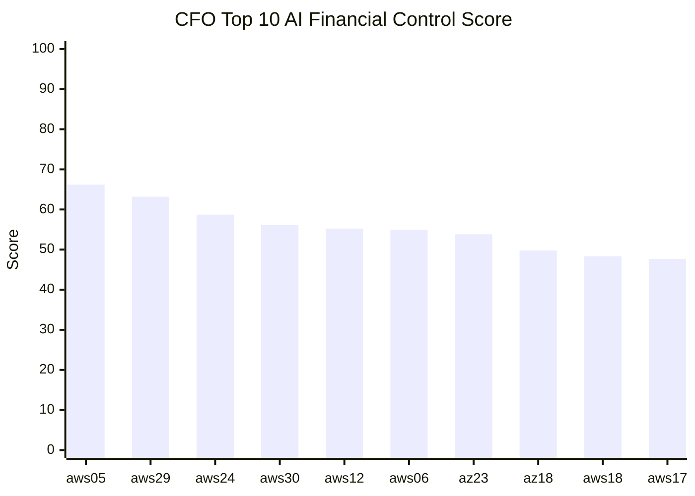
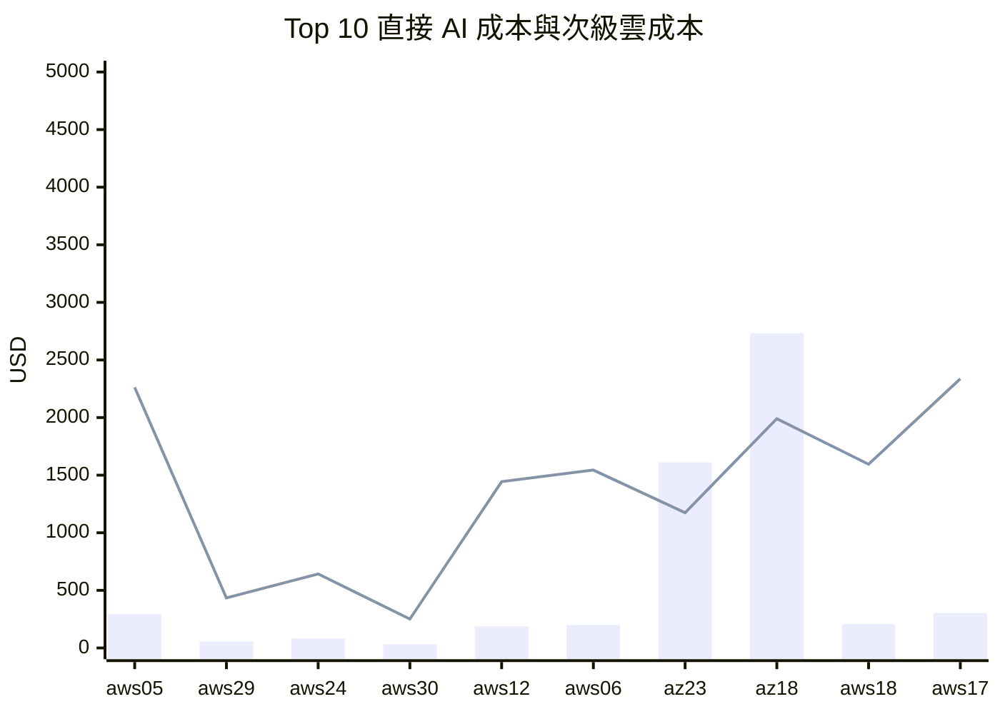
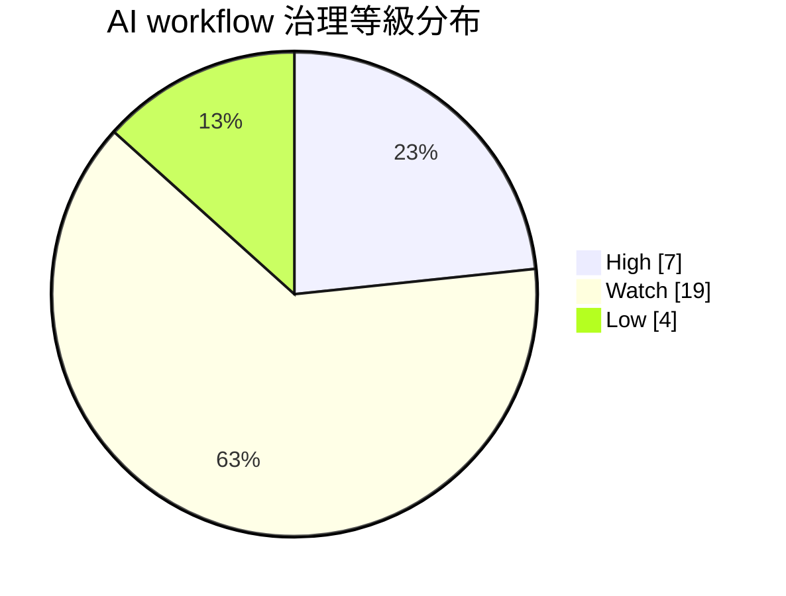
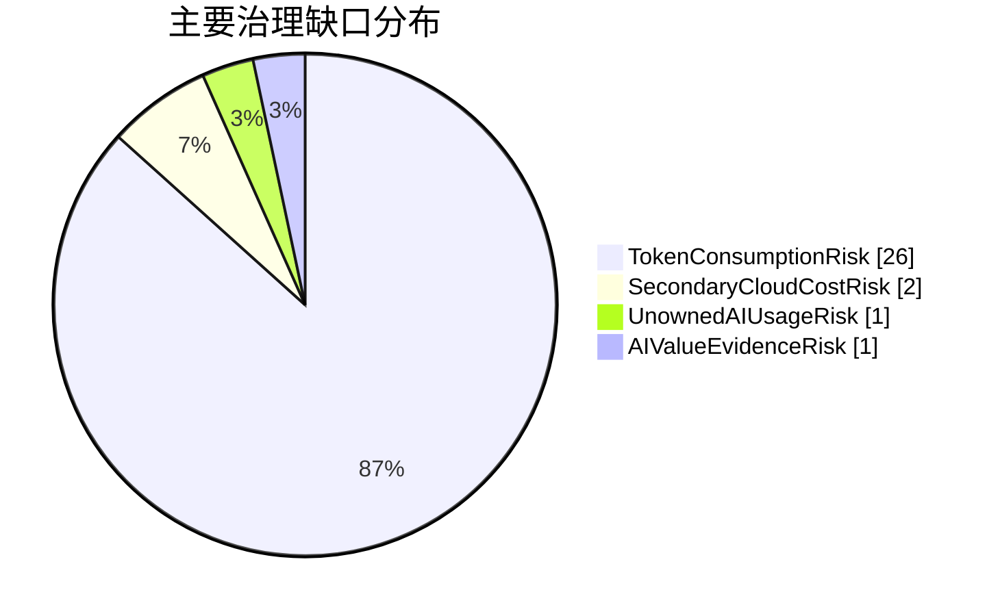

# demo005：AI Financial Control Score

本 demo 將 `docs/cfo_ai_tokenomics_finops_view.md` 的 AI Financial Control Score 實作成可查詢的 PostgreSQL 範例。

CFO 問題不是「哪個 AI 專案最貴」，而是：

> 哪些 AI 與雲端消費正在破壞預算可預測性、毛利可信度與治理責任？

## CFO 敘事

AI 成本的風險不只來自模型 API 或 GPU compute。token、agent run、工具呼叫、資料庫、儲存與 owner 缺口會一起影響財務可信度。這個 demo 把 FOCUS 成本資料與 AI workflow 使用量補充資料合併，讓 CFO 可以排序高風險 AI workflow，並知道主要缺口是 token 爆量、agent 波動、次級雲成本、價值證據不足，還是沒有 owner/guardrail。

## 實際執行結果

以下結果來自本機 PostgreSQL 驗證輸出，原始 logs 保存在 ignored 的 `outputs/demo005/` 目錄中。

### 驗證摘要

| 驗證項目 | 結果 |
|---|---:|
| `focus.cost_usage` 欄位數 | 107 |
| `focus.cost_usage` 資料列 | 493,020 |
| `business.ai_workflow_controls` 資料列 | 30 |
| `business.ai_workflow_daily_usage` 資料列 | 5,400 |
| `business.mv_ai_financial_control_score` 資料列 | 30 |

### CFO Top 10 AI 治理風險

| project_id | project_name | business_unit | workflow_type | business_owner | m30_tokens | m30_direct_ai_cost | m30_secondary_cloud_cost | ai_financial_control_score | control_level | primary_control_gap |
|---|---|---|---|---|---:|---:|---:|---:|---|---|
| `aws-prj-05` | AWS Project 05 | research | ModelTraining | research-ai-owner | 91,084,800 | 292.71 | 2,262.21 | 66.20 | High | TokenConsumptionRisk |
| `aws-prj-29` | AWS Project 29 | research | ModelTraining | research-ai-owner | 94,509,600 | 56.17 | 434.10 | 63.20 | High | TokenConsumptionRisk |
| `aws-prj-24` | AWS Project 24 | product | AgenticCustomerWorkflow | product-ai-owner | 75,464,963 | 83.14 | 642.52 | 58.70 | High | TokenConsumptionRisk |
| `aws-prj-30` | AWS Project 30 | product | AgenticCustomerWorkflow | product-ai-owner | 34,663,200 | 32.46 | 250.90 | 56.11 | High | TokenConsumptionRisk |
| `aws-prj-12` | AWS Project 12 | product | AgenticCustomerWorkflow | product-ai-owner | 56,182,080 | 186.85 | 1,444.04 | 55.25 | High | TokenConsumptionRisk |
| `aws-prj-06` | AWS Project 06 | product | AgenticCustomerWorkflow | product-ai-owner | 42,074,640 | 199.83 | 1,544.40 | 54.88 | High | TokenConsumptionRisk |
| `az-prj-23` | Azure Project 23 | research | ModelTraining | research-ai-owner | 64,814,400 | 1,611.81 | 1,174.17 | 53.82 | High | TokenConsumptionRisk |
| `az-prj-18` | Azure Project 18 | product | AgenticCustomerWorkflow | product-ai-owner | 65,743,523 | 2,732.41 | 1,990.50 | 49.77 | Watch | TokenConsumptionRisk |
| `aws-prj-18` | AWS Project 18 | product | AgenticCustomerWorkflow | product-ai-owner | 49,145,520 | 206.33 | 1,594.58 | 48.33 | Watch | TokenConsumptionRisk |
| `aws-prj-17` | AWS Project 17 | research | ModelTraining | research-ai-owner | 47,174,400 | 302.38 | 2,336.92 | 47.65 | Watch | SecondaryCloudCostRisk |





### 治理缺口彙總

| control_level | primary_control_gap | workflow_count | average_control_score | m30_tokens | m30_direct_ai_cost | m30_secondary_cloud_cost | unowned_workflows | weak_guardrail_workflows |
|---|---|---:|---:|---:|---:|---:|---:|---:|
| High | TokenConsumptionRisk | 7 | 58.31 | 458,793,683 | 2,462.97 | 7,752.34 | 0 | 4 |
| Watch | SecondaryCloudCostRisk | 2 | 43.11 | 100,051,380 | 424.09 | 3,277.54 | 0 | 0 |
| Watch | TokenConsumptionRisk | 17 | 39.80 | 1,031,934,909 | 19,940.61 | 16,092.11 | 3 | 5 |
| Low | UnownedAIUsageRisk | 1 | 24.08 | 58,102,200 | 3,876.43 | 2,823.90 | 1 | 0 |
| Low | TokenConsumptionRisk | 2 | 15.29 | 130,007,040 | 1,766.00 | 732.46 | 0 | 0 |
| Low | AIValueEvidenceRisk | 1 | 9.04 | 60,687,420 | 4,004.46 | 2,917.17 | 0 | 0 |





### 成本與價值證據

| business_unit | workflow_type | value_evidence_status | workflow_count | m30_tokens | m30_ai_related_cost | m30_estimated_business_value_usd | average_control_score |
|---|---|---|---:|---:|---:|---:|---:|
| product | AgenticCustomerWorkflow | Weak | 2 | 141,208,486 | 5,448.57 | 1,067.54 | 54.24 |
| research | ModelTraining | Weak | 3 | 257,479,200 | 4,868.18 | 1,946.54 | 53.83 |
| research | ModelTraining | Missing | 3 | 186,883,200 | 5,763.90 | 504.58 | 49.57 |
| product | AgenticCustomerWorkflow | Missing | 2 | 114,406,726 | 5,700.75 | 308.90 | 44.54 |
| product | AgenticCustomerWorkflow | Validated | 11 | 528,324,000 | 15,528.16 | 6,181.38 | 43.95 |
| research | ModelTraining | Validated | 9 | 611,275,020 | 28,760.52 | 7,922.13 | 27.04 |

### CFO 解讀

這次結果顯示 `TokenConsumptionRisk` 主導大多數 High 與 Watch workflow，代表第一版 AI Financial Control Score 成功抓到 AI token demand 超過預算假設的問題。這符合 CFO 對 AI tokenomics 的主要擔憂：單價下降不代表總支出可控，因為 agent、context 與自動化使用量可能快速擴張。

第二個重要訊號是 `SecondaryCloudCostRisk`。`aws-prj-17` 雖然分數低於 High 門檻，但次級雲成本高於直接 AI 成本，這提醒 CFO 不應只看模型或 GPU 費用。資料庫、儲存、分析與資料搬移常常才是 AI 成本擴張後留下的長尾。

這版 demo 也刻意保留 owner 與 guardrail 缺口，但它們沒有主導 Top 10。後續如果要展示治理責任風險，應加強沒有 owner、沒有 guardrail、或價值證據缺失的情境資料，避免指標長期被 token 消費量單一因素主導。

## 輸出欄位

| 欄位 | CFO 解讀 |
|---|---|
| `ai_financial_control_score` | 0 到 100 的 AI 財務治理分數，分數越高越需要 CFO 介入 |
| `control_level` | Low、Watch、High 或 Critical |
| `primary_control_gap` | 對總分貢獻最大的 AI 治理缺口 |
| `m30_tokens` | 最近 30 天 token 使用量，用來比較月度 token 預算 |
| `m30_direct_ai_cost` | 直接支援 AI workflow 的 Compute 或 Analytics 成本 |
| `m30_secondary_cloud_cost` | 支援 AI workflow 的 Database 或 Storage 成本 |
| `value_evidence_status` | AI 支出是否有可驗證的業務價值證據 |
| `recommended_cfo_action` | 依治理分級建議 CFO 採取的行動 |

## 實作過程

以下保留可追溯的 demo 流程、分數公式與 SQL 入口。完整可執行 SQL 以 `.sql` 檔案為準；README 僅摘要關鍵邏輯，避免把長 SQL 直接重複成閱讀負擔。

## Demo 流程

1. `01_create_ai_financial_control_score.sql` 建立 `business.ai_workflow_controls`、`business.ai_workflow_daily_usage` 與 `business.mv_ai_financial_control_score`。
2. `02_ai_financial_control_score_top10.sql` 輸出 CFO 應優先追蹤的 Top 10 AI workflow。
3. `03_ai_control_gap_breakdown.sql` 依治理等級與主要缺口彙總，支援 CFO/CTO AI 治理會議。
4. `04_ai_cost_value_evidence_summary.sql` 依 business unit、workflow type 與價值證據狀態彙總 AI 相關成本與估計價值。

## 風險公式

```text
AI Financial Control Score = 100 * (
    0.30 * TokenConsumptionRisk
  + 0.25 * AgenticWorkflowVolatilityRisk
  + 0.20 * SecondaryCloudCostRisk
  + 0.15 * AIValueEvidenceRisk
  + 0.10 * UnownedAIUsageRisk
)
```

## SQL 設計摘要

### 01 建立 AI workflow 補充資料

`business.ai_workflow_controls` 保存 AI workflow 的 owner、token 預算、價值證據與 guardrail 狀態。`business.ai_workflow_daily_usage` 保存每日 token、agent run、工具呼叫與估計業務價值。這些資料不是 FOCUS 標準欄位，因此放在 `business` schema。

### 02 將 FOCUS 成本映射到 AI 專案

物化視圖使用 `focus.cost_usage` 的 `"Tags"`、`"ServiceCategory"`、`"ServiceName"`、`"EffectiveCost"` 與 business mapping，把 AI workflow 專案的直接 AI 成本與次級雲成本分開。

### 03 計算 token、agent、成本與治理風險

SQL 使用最近 30 天與 90 天視窗計算 token 消費、agent run 波動、次級雲成本占比、價值證據缺口與 owner/guardrail 缺口，再正規化為 0 到 1 的子風險。

### 04 輸出 CFO 管理欄位

最後輸出 `control_level`、`primary_control_gap` 與 `recommended_cfo_action`，讓 CFO 可以直接判斷要凍結擴張、要求補 token cap 與價值證據，或納入一般 AI FinOps cadence。
